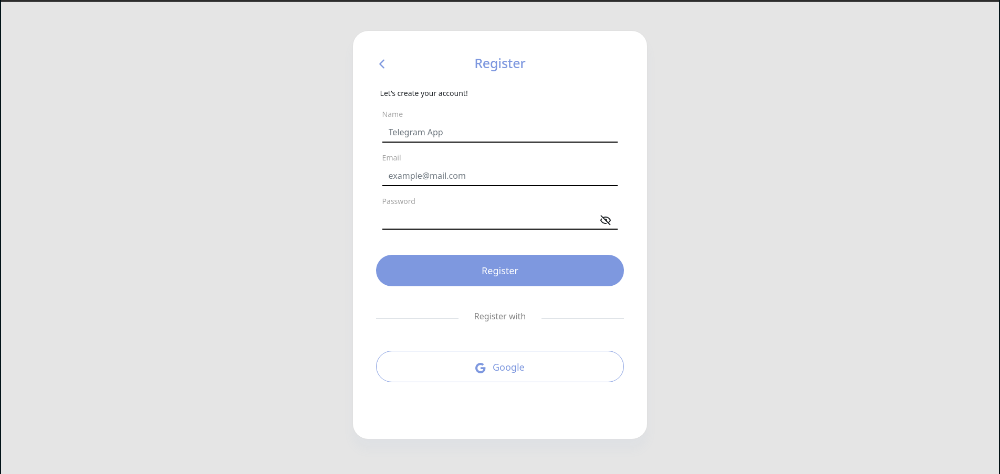
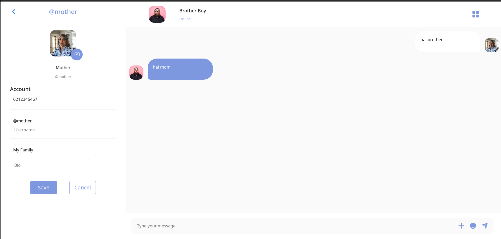

<div id="top"></div>

<!-- PROJECT LOGO -->
<br />
<div align="center">
    <h2>Telegram</h2>

<h3 align="center">Telegram Web App</h3>

  <p align="center">
    <a href="https://telegram-fe-ochre.vercel.app/">View Demo</a>
    ·
    <a href="https://github.com/roufurrohim/telegram-fe">Report Bug</a>
    ·
    <a href="https://github.com/roufurrohim/telegram-fe">Request Feature</a>
  </p>
</div>


<!-- TABLE OF CONTENTS -->
<details>
  <summary>Table of Contents</summary>
  <ol>
    <li>
      <a href="#about-the-project">About The Project</a>
      <ul>
        <li><a href="#built-with">Built With</a></li>
      </ul>
    </li>
    <li>
      <a href="#getting-started">Getting Started</a>
      <ul>
        <li><a href="#getting-started">Prerequisites</a></li>
        <li><a href="#getting-started">Installation</a></li>
      </ul>
    </li>
    <li><a href="#roadmap">Roadmap</a></li>
    <li><a href="#contact">Contact</a></li>
    <li><a href="#contact">Screenshot</a></li>
  </ol>
</details>


<!-- ABOUT THE PROJECT -->
<div id="#about-the-project"></div>

## About The Project


Telegram is a web app that users can create their personal account, send for messages. this app built with React.js, Redux. The server side was created with Node.js and Express.js.

<p align="right">(<a href="#top">back to top</a>)</p>


<div id="#built-with"></div>

### Built With

* [React.js](https://reactjs.org/)
* [Reactstrap](https://reactstrap.github.io/)
* [React-Router-Dom](https://reactrouter.com/web/guides/quick-start)
* [redux](https://redux.js.org/)
* [socket.io-client](https://github.com/socketio/socket.io-client#readme)

<p align="right">(<a href="#top">back to top</a>)</p>


<!-- GETTING STARTED -->
<div id="#getting-started"></div>

## Getting Started

### Prerequisites

* npm
  ```sh
  npm install npm@latest -g
  ```

### Installation

1. Clone the repo backend
    ```sh
    git clone https://github.com/roufurrohim/zwallet-BE
    ```

2. Clone the repo frontend
   ```sh
   git clone https://github.com/roufurrohim/telegram-fe
   ```
3. Install NPM packages
   ```sh
   npm install
   ```
4. Start project
   ```sh
   npm start
   ```

<p align="right">(<a href="#top">back to top</a>)</p>

<div id="#roadmap"></div>

<!-- ROADMAP -->
## Roadmap

- [ ] Git clone repository frontend and backend
- [ ] npm install
- [ ] Register
- [ ] Option contact
- [ ] Chat
- [ ] View Profile contact
- [ ] View profile
- [ ] Edit Profile


<p align="right">(<a href="#top">back to top</a>)</p>


<div id="#screenshot"></div>

## Screenshot

Below is a sample screenshot of the App Coffee Shop website and mobile display for users.

---------------------------------------------------
Display Web|Display Web
:-----------------------:|:----------------------------:
 | 
 | 
 | 

---------------------------------------------------
Display Mobile|Display Mobile
:-----------------------:|:----------------------------:
.png) | .png)
.png) | .png)
.png) | .png)


<p align="right">(<a href="#top">back to top</a>)</p>